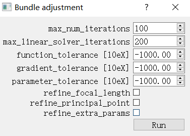

# appearance-scanner

## About

This repository is an implementation of the neural network proposed in [Free-form Scanning of Non-planar Appearance with Neural Trace Photography](https://svbrdf.github.io/publications/scanner/project.html)

## Usage
### System Requirement

+ Windows or Linux(The codes are validated on Win10, Ubuntu 18.04 and Ubuntu 16.04)
+ Python >= 3.6.0
+ Pytorch >= 1.6.0
+ tensorflow>=1.11.0, meshlab and matlab are needed if you process the test data we provide  

### Training

1. move to appearance_scanner
2. run train.bat or train.sh according to your own platform 

Notice that the data generation step
```
python data_utils/origin_parameter_generator_n2d.py %data_root% %Sample_num% %train_ratio%
``` 

should be run only once.

### Training Visulization

When training is started, you can open tensorboard to observe the training process.
There will be two log images of a certain training sample, one is the sampled lumitexels from 64 views and the other is an composite image from six images in the order of groundtruth lumitexel, groundtruth diffuse lumitexel, groundtruth specular lumitexel, predicted lumitexel, predicted diffuse lumitexel and predicted specular lumitexel.

<table>
    <tr>
    <td></td> 
    <td></td> </td></tr>
</table>


Trained lighting pattern will also be showed. Trained model will be found in the `log_dir` set in train.bat/train.sh.

### License

```
@article{Ma:2021:Scanner,
author = {Ma, Xiaohe and Kang, Kaizhang and Zhu, Ruisheng and Wu, Hongzhi and Zhou, Kun},
title = {Free-Form Scanning of Non-Planar Appearance with Neural Trace Photography},
year = {2021},
issue_date = {August 2021},
publisher = {Association for Computing Machinery},
address = {New York, NY, USA},
volume = {40},
number = {4},
issn = {0730-0301},
url = {https://doi.org/10.1145/3450626.3459679},
doi = {10.1145/3450626.3459679},
journal = {ACM Trans. Graph.},
month = jul,
articleno = {124},
numpages = {13},
keywords = {illumination multiplexing, SVBRDF, optimal lighting pattern}
}
```
For commercial licensing options, please email hwu at acm.org.
See COPYING for the open source license.


## Reconstruction process

Download our Cheongsam test data and unzip it in the data folder.

Link: 

### 1. Camera Registration 

#### 1.1 Run `SFM/run.bat` first to brighten the raw images

#### 1.2 Open Colmap and do the following steps

**1.2.1** New project


**1.2.2** Feature extraction

Copy the parameters of our camera in Cheongsam/cam.txt to `Custom parameters`.


**1.2.3** Feature matching

Tick `guided_matching` and run.


**1.2.4**  Reconstruction options

Do **not** tick `multiple_models` in the General sheet.


Do **not** tick `refine_focal_length/refine_extra_params/use_pba` in the Bundle sheet.


Start reconstruction.

**1.2.5** Bundle adjustment

Do **not** tick `refine_focal_length/refine_principal_point/refine_extra_params`.



**1.2.6** 

Make a folder named undistort_feature in Cheongsam/ and  export model as text in undistort_feature folder


**1.2.7** 

Dense reconstruction -> select undistort_feature folder -> Undistortion -> Stereo

Since we upload all the photos we taken,  it will take a long time to run this step.
We strongly recommend you run

```
colmap stereo_fusion --workspace_path path --input_type photometric --output_path path/fused.ply

//change path to undistort_feature folder
``` 


when the files amount in undistort_feature/stereo/normal_maps arise to around 200-250. 
It will output a coarse point cloud in undistort_feature/ .


Delete the noise points and the table plane.


Save fused.ply.


### 2. Extract measurements

run extract_measurements/run.bat 

### 3. Align mesh

#### 3.1 Use meshlab to align mesh roughly

Open fused.ply and Cheongsam/scan/Cheongsam.ply in the same meshlab window.


Align two mesh and save project file in Cheongsam/scan/Cheongsam.aln, which records the transform matrix between two meshes.

run `CoherentPointDrift/run.bat` to align Cheongsam.ply to fused.ply. 


#### 3.2 Further Alignment

run `CoherentPointDrift/CoherentPointDrift-master/simplify/run.bat` to simplify two meshes.

Open the CPD project in Matlab and run `main.m`.


After alignment done, run `CoherentPointDrift/run_pass2.bat`. meshed-poisson_obj.ply will be saved in undistort_feature/ .

You should open fused.ply and meshed-poisson_obj.ply in the same meshlab window to check the quality of alignment. It is a key factor in the final result.

### 4. Generate view information from registrated cameras

#### 4.1

 run `ACVD/aarun.bat` and save undistort_feature/meshed-poisson_obj_remeshed.ply as undistort_feature/meshed-poisson_obj_remeshed.obj

#### 4.2

copy data_processing/device_configuration/extrinsic.bin to undistort_feature/
run `generate_texture/trans.bat` to transform mesh from colmap frame to world frame in our system and generate uv maps.

We recommend that you generate uv maps with resolution of 512x512 because it will save a lot of time and retain most details. The resolution of the results in our paper is 1024x1024. 

You can set `UVMAP_WIDTH` and `UVMAP_HEIGHT` to 1024 in `uv/uv_generator.bat` if you pursue higher quality.

#### 4.3

in `generate_texture/texgen.bat`, set `TEXTURE_RESOLUTION` to the certain resolution

choose the same line or the other reference on meshed-poisson_obj_remeshed.obj and on the physical object, then meature the lengths of both. Set the results to `COLMAP_L` and `REAL_L`. `REAL_L` in mm.


The marker cylinder's diameter is 10cm, so we set `REAL_L` to 100.


run `generate_texture/texgen.bat` to output view information of all registrated cameras

### 5. Gather data

run `gather_data/run.bat` to gather the inputs to the network for each valid pixel on the texture map.


